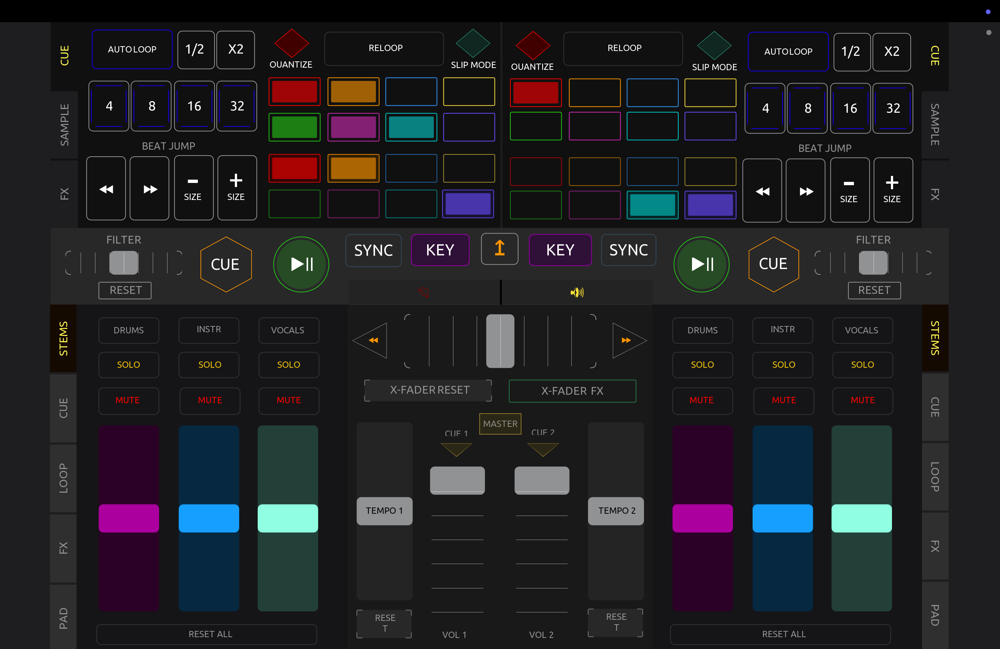
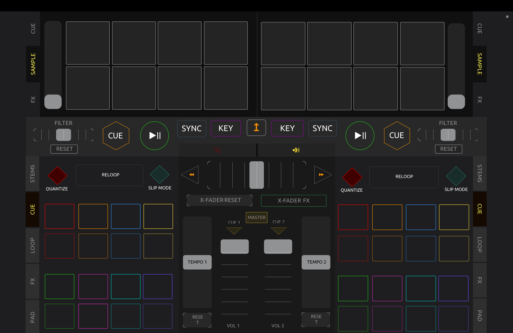
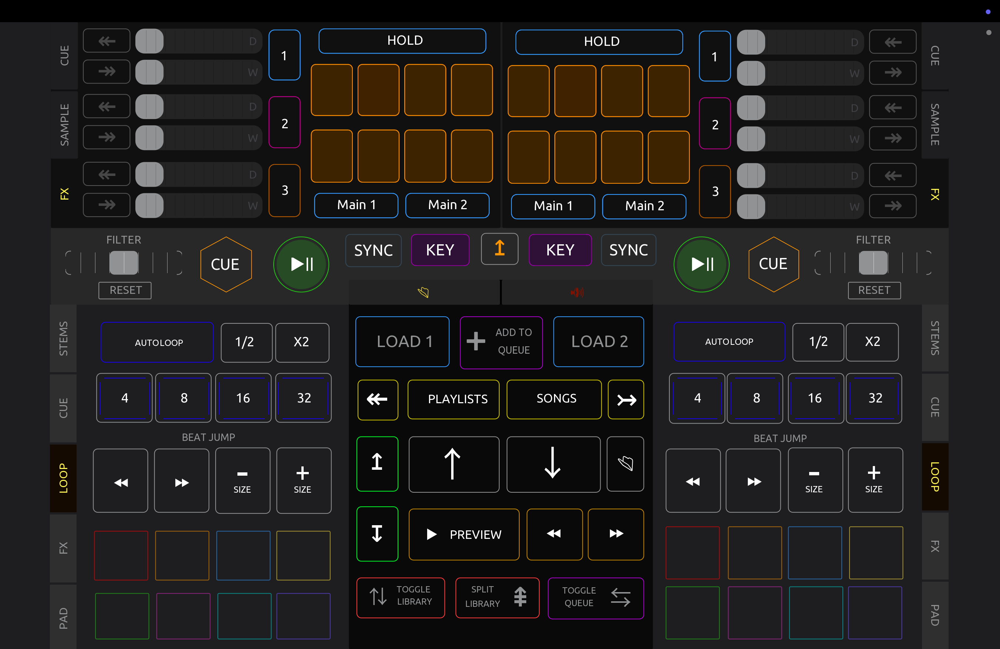
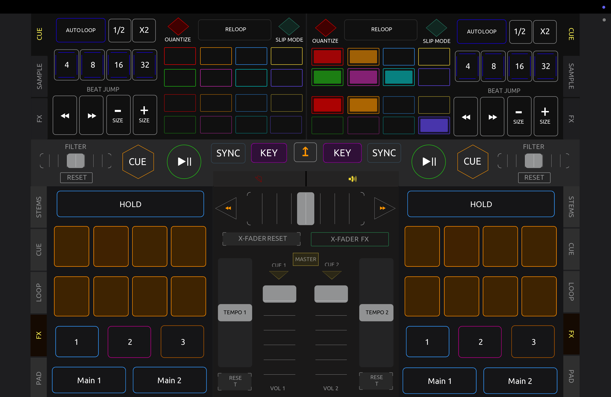
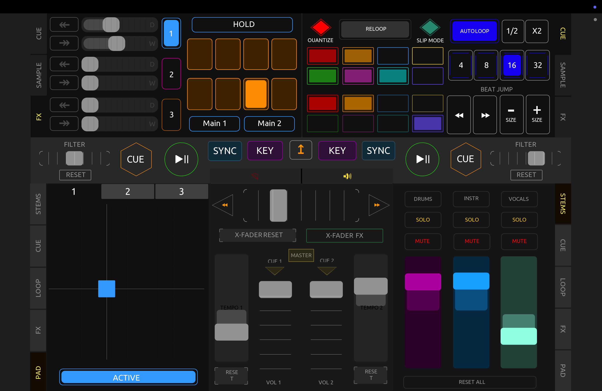

# TouchOSC Controller for djay Pro (macOS)

An updated TouchOSC controller covering most functionality for the **macOS version of djay Pro**.

---

## Requirements

- **TouchOSC** by Hexler LLC — Paid version ([hexler.net/touchosc](https://hexler.net/touchosc)) | [Manual](https://hexler.net/touchosc/manual)
  - _Note: This is for the current TouchOSC app, not the legacy TouchOSC MK1 app. Compatibility with MK1 is untested._
- **TouchOSC Bridge** — installed on your Mac ([download](https://hexler.net/touchosc#resources))
- **djay Pro** for macOS ([algoriddim.com](https://www.algoriddim.com/djay-pro-mac)) | [User Manual](https://help.algoriddim.com/user-manual/djay-pro-mac) | [Community Forums](https://community.algoriddim.com)

## Tested With

| Component | Version |
|-----------|---------|
| TouchOSC | 1.4.8 |
| djay Pro (macOS) | 5.6.1 |
| macOS | Tahoe 26.2 |
| Hardware | Apple M5 — 24 GB RAM |

---

## Download

Download the latest `.tosc` and `.djayMidiMapping` files from this repository:

**[https://github.com/EarthmanWeb/DJAY-PRO-TOUCH-OSC-CONTROLLER](https://github.com/EarthmanWeb/DJAY-PRO-TOUCH-OSC-CONTROLLER)**

You only need these two files:
- `TEEE-EMMEDIA.tosc`
- `TEEE-EMMEDIA.djayMidiMapping`

> **Note:** The `/scripts` folder and `.gitignore` are not required for use — they are included for visibility and development purposes only.

---

## Installation Overview

Full installation instructions for each step can be found via the Hexler and Algoriddim documentation:

1. **Install TouchOSC (paid version) on your iPad** — [TouchOSC on the App Store](https://apps.apple.com/app/touchosc/id1569996730)
2. **Load the `.tosc` file onto your iPad** — [TouchOSC Editor & File Transfer docs](https://hexler.net/touchosc/manual/editor)
3. **Install TouchOSC Bridge on your Mac** and ensure it is running — [TouchOSC Bridge download](https://hexler.net/touchosc#resources)
4. **Configure the MIDI bridge** — [TouchOSC Connections documentation](https://hexler.net/touchosc/manual/connections-midi)
5. **Load the `.djayMidiMapping` file into djay Pro** once the bridge is successfully configured — [djay Pro MIDI Mapping guide](https://help.algoriddim.com/user-manual/djay-pro-mac/midi/mapping)

---

## Special Thanks

Special thanks for the head start from this thread on the Algoriddim community forums:

[iPad remote for djay on Mac — Algoriddim Community](https://community.algoriddim.com/t/ipad-remote-for-djay-on-mac/21474/33)

---

## Disclaimer

This project is provided for **educational purposes only**. No warranty is intended or implied. Use at your own risk.

---

## Support

Please see [SUPPORT.md](SUPPORT.md) for details.

---

## Screenshots

